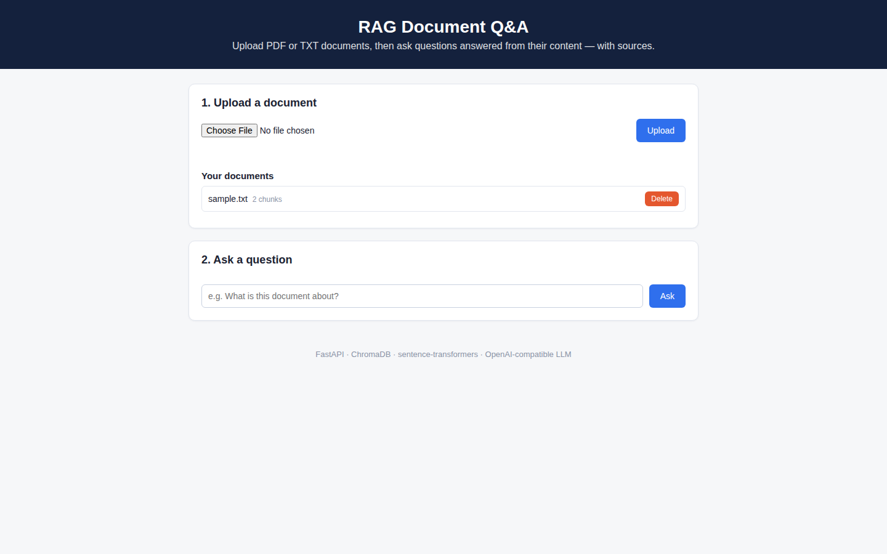

# RAG Document Q&A

Upload PDF or TXT documents and ask questions about them in plain language. The app retrieves the most relevant passages from your documents and generates an answer grounded in those passages, with the source chunks shown for every answer — a complete, runnable example of Retrieval-Augmented Generation (RAG).

## Features

- **Document upload** — PDF and TXT files are extracted, split into overlapping chunks, embedded, and indexed automatically.
- **Semantic search** — questions are matched against document chunks by meaning, not just keywords.
- **Grounded answers** — the LLM answers strictly from the retrieved excerpts, and every response includes its sources (filename, chunk, similarity score).
- **Runs without paid APIs** — embeddings are computed locally with `sentence-transformers`; an LLM key is only needed for answer generation. Without a key, the API still returns retrieval results with a clear notice.
- **Any OpenAI-compatible LLM** — works with OpenAI, Azure OpenAI, Ollama, LM Studio, and other compatible endpoints via environment variables.
- **Simple web UI** — upload box, document list, and a chat-style Q&A panel served by the same FastAPI app.

## Architecture

```
            ┌────────────┐   chunks    ┌──────────────────┐
  PDF/TXT ─▶│ Ingestion  │────────────▶│    ChromaDB      │
            │ extract +  │  embeddings │  (persistent     │
            │ chunk      │             │   vector store)  │
            └────────────┘             └────────┬─────────┘
                                              │ top-k chunks
  Question ─▶ embed ─▶ Retrieval ────────────┘
                              │
                              ▼
                     ┌────────────────┐   answer    ┌─────────┐
                     │  LLM (OpenAI-  │────────────▶│ Web UI / │
                     │  compatible)   │  + sources  │   API    │
                     └────────────────┘             └─────────┘
```

## Tech Stack

| Layer        | Technology                                   |
|--------------|----------------------------------------------|
| API / Web    | FastAPI, Uvicorn                             |
| Vector store | ChromaDB (local, persistent)                 |
| Embeddings   | sentence-transformers (`all-MiniLM-L6-v2`)   |
| LLM          | OpenAI-compatible API (configurable)         |
| PDF parsing  | pypdf                                        |
| Frontend     | Vanilla HTML / CSS / JavaScript              |

## Quick Start

### 1. Clone and install

```bash
git clone https://github.com/<your-username>/rag-doc-qa.git
cd rag-doc-qa
python -m venv .venv
source .venv/bin/activate        # Windows: .venv\Scripts\activate
pip install -r requirements.txt
```

The embedding model (~90 MB) downloads automatically on first run.

### 2. Configure the LLM (optional but recommended)

```bash
cp .env.example .env
# Edit .env and set OPENAI_API_KEY. Without it, retrieval still works
# and /ask returns the source chunks with an explanatory message.
```

Any OpenAI-compatible endpoint works, for example a local Ollama server:

```bash
OPENAI_API_KEY=ollama
OPENAI_BASE_URL=http://localhost:11434/v1
LLM_MODEL=llama3.1
```

### 3. Run

```bash
uvicorn app.main:app --reload
```

Open http://localhost:8000 for the web UI, or http://localhost:8000/docs for the interactive API docs.

### Docker

```bash
docker build -t rag-doc-qa .
docker run -p 8000:8000 -e OPENAI_API_KEY=your-key -v rag-data:/code/data rag-doc-qa
```

## API Endpoints

| Method | Endpoint            | Description                                  |
|--------|---------------------|----------------------------------------------|
| GET    | `/health`           | Service status and LLM configuration         |
| POST   | `/documents`        | Upload a PDF/TXT file (multipart form)       |
| GET    | `/documents`        | List uploaded documents                      |
| DELETE | `/documents/{id}`   | Delete a document and its indexed chunks     |
| POST   | `/ask`              | Ask a question; returns answer + sources     |
| GET    | `/`                 | Web UI                                       |

## Example Usage (curl)

```bash
# Upload a document
curl -X POST http://localhost:8000/documents \
  -F "file=@samples/sample.txt"

# List documents
curl http://localhost:8000/documents

# Ask a question
curl -X POST http://localhost:8000/ask \
  -H "Content-Type: application/json" \
  -d '{"question": "What support channels does the company offer?"}'
```

Example response:

```json
{
  "answer": "The company offers support by email and live chat...",
  "llm_configured": true,
  "sources": [
    {
      "filename": "sample.txt",
      "chunk_index": 1,
      "score": 0.62,
      "text": "Customer support is available by email at support@example.com and through live chat..."
    }
  ]
}
```

## Project Structure

```
rag-doc-qa/
├── app/
│   ├── main.py         # FastAPI app and endpoints
│   ├── config.py       # Environment-based configuration
│   ├── ingestion.py    # Text extraction + chunking + indexing
│   ├── retrieval.py    # Semantic search over chunks
│   ├── embeddings.py   # Local embedding model wrapper
│   ├── llm_client.py   # OpenAI-compatible answer generation
│   ├── store.py        # ChromaDB access + document registry
│   └── static/         # Web UI (index.html, style.css, app.js)
├── samples/            # Example document to try
├── requirements.txt
├── Dockerfile
└── .env.example
```

## Screenshots



The web UI: upload a PDF or TXT document, see it in your document list (here `sample.txt`, indexed into 2 chunks), and ask questions answered from the document content with sources.

## Notes

- Chunking uses 1,000-character chunks with 200-character overlap, tuned for short factual documents. Adjust `CHUNK_SIZE` / `CHUNK_OVERLAP` in `app/ingestion.py` for longer or denser material.
- Data (vectors + document registry) persists under `data/` and survives restarts. Delete that folder to reset the index.

## License

MIT — see [LICENSE](LICENSE).

---
**More projects by Nisar Ahmad** — [GitHub profile](https://github.com/nisarahmad78) · [Portfolio site](https://nisarahmad78.github.io)
- [VOCALIQ — AI Voice Customer Experience Platform](https://github.com/nisarahmad78/VOCALIQ)
- [RAG Document Q&A](https://github.com/nisarahmad78/rag-document-qa)
- [LangGraph AI Agent](https://github.com/nisarahmad78/langgraph-ai-agent)
- [MCP Server Suite](https://github.com/nisarahmad78/mcp-server-suite)
- [AI Support Desk](https://github.com/nisarahmad78/ai-support-desk)
- [LLM Gateway](https://github.com/nisarahmad78/llm-gateway)
